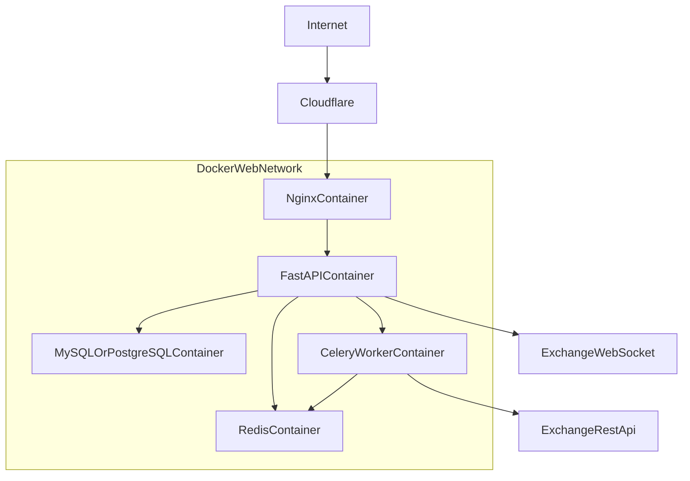

# PrismQuant Master Checklist (v2)

> On-Premise Crypto Trading Platform based on Mac Mini M4
> 서비스 레벨 자동 매매 시스템 구축을 위한 5단계 실행 체크리스트 문서입니다.

---

## Quick Start

### How to Use
- Zero-Dependency: 별도 런타임 설치 없이 단일 HTML 파일로 실행합니다.
- Open File: `prismquant_plan_checklist.html` 파일을 브라우저(Safari, Chrome)로 엽니다.
- Daily Use: 북마크로 등록해 진행률 대시보드처럼 상시 확인합니다.

### Progress State Policy (v2)
- 체크 상태 저장 키: `prismquant_tasks_v2`
- 구버전 키(`prismquant_master_state`, `prismquant_tasks`)는 자동 마이그레이션하지 않고 분리 운용합니다.
- 필요 시 구버전 상태는 콘솔의 `window.__prismquant_legacy_backup`에서 확인 가능합니다.

---

## Tech Stack

- UI: `Tailwind CSS`
- Icon: `Lucide Icons`
- State: `Browser LocalStorage`
- Core Script: `Vanilla JavaScript`

---

## Project Roadmap (5 Phases)

### Phase 1: 인프라 및 홈 서버 네트워크 세팅
- Mac 절전/전원/고정 IP 최적화
- 포트포워딩(80/443) 및 Cloudflare DNS/SSL(Strict) 구성
- Docker Desktop 및 `web-network` 기반 기본 Compose 골격 준비

### Phase 2: 데이터베이스 및 메시지 브로커 구축
- MySQL/PostgreSQL 컨테이너 + 볼륨 마운트
- `Users`, `API_Keys`, `Trade_Logs` 스키마 및 마이그레이션
- Redis를 Celery Broker/Result Backend + 캐시로 구성

### Phase 3: 코어 웹 서버 개발 (FastAPI & Nginx)
- FastAPI 프로젝트 구조(routers/models/schemas/core/services) 정리
- Nginx 리버스 프록시 및 Cloudflare Origin 인증서 적용
- Upbit/Binance WebSocket 수신 및 내부 파이프라인 연결

### Phase 4: 비동기 매매 워커 구성 (Celery & 거래소 API)
- Celery Worker 분리 및 매수/매도 Task 정의
- 거래소 API Rate Limit 제어(Token Bucket 등) 적용
- `autoretry_for` + Exponential Backoff 기반 장애 복원력 확보

### Phase 5: 전략 알고리즘 통합 및 로깅/모니터링
- 전략 모듈 인터페이스화(규칙 기반/ML 확장 대비)
- Filebeat/Fluentd -> Elasticsearch -> Kibana 로그 파이프라인 구축
- 실시간 매매/에러/리소스 관제 대시보드 구성

---

## Target Service Topology



---

## Backlog / Future Scope

<details>
<summary>중장기 과제 보기</summary>

- Streamlit 운영자 대시보드 고도화
- B2C 사용자 웹 대시보드(React/Next.js)
- 백테스팅 고도화(시나리오/리포트 자동화)
- DR 자동화(정기 백업, 외부 스토리지 전송, 복구 리허설)
- AI/센티먼트/온체인 신호 결합 전략

</details>

---

## Current Files

```text
.
├── prismquant_plan_checklist.html
├── README.md
└── PrismQ.png
```

PrismQuant Project